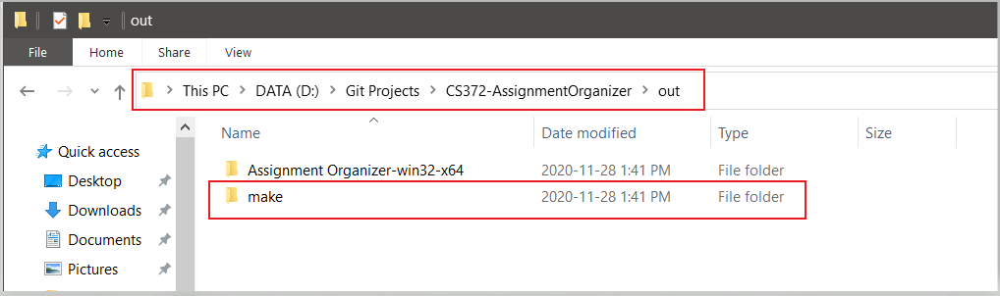

# README

Assignment Organizer is an [electron-based](https://www.electronjs.org/) app that we created as part of a university project. It allows a student to back-up the school assignments in a central place.

## Features

- [x] Add Semester
- [x] Edit Semester
- [x] Delete Semester
- [x] Add Course
- [x] Edit Course
- [x] Delete Course
- [x] Add Assignment (added assignment is backed-up locally)
- [x] Open Assignment
- [x] Delete Assignment
- [x] Set custom folder for back-up
- [ ] Back-up on cloud i.e. Google Drive

### Prerequisites

- Install `node.js` from [here](https://nodejs.org/en/).

- Install `git` from [here](https://git-scm.com/downloads).

### Running the code

- Download code `.zip` file or clone the repository as shown below.

- Install node dependencies.

```sh
cd CS372-AssignmentOrganizer
npm install
```

- Run the app code manually or build the installer for the app.

```sh
# run the code
npm start
```
```sh
# Alternatively, create the installer for your platform. 
# This can take some time depending on the hardware and software specs of the system.
npm run make
```

- Using `npm run make` command will create an `out` folder in the cloned directory. The `out` folder will have a `make` directory which will contain the installer for your platform. 
  
- **For Linux, the `make` folder will include a `zip` file with the app's executable. You can unzip the `zip` file and launch the app from the terminal window (from within the unzipped directory) using the command `./assignment-organizer`.**

<br>



<br>

- **Windows installer is a no-nonsense installer which does not require any user input once it is launched. The installer silently installs the app and when installed, it launches the app automatically.**

- **On macOS, a `.dmg` installer will be created.** 

